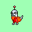

# CryptoDickButts OnChain

[CryptoDickButts Series 3](https://opensea.io/collection/cryptodickbutts-s3) is an NFT collection deployed on the Ethereum blockchain at [0x42069abfe407c60cf4ae4112bedead391dba1cdb](https://etherscan.io/address/0x42069abfe407c60cf4ae4112bedead391dba1cdb#code). See also: [OpenSea](https://opensea.io/collection/cryptodickbutts-s3) and [Twitter](https://twitter.com/CryptoDickbutts) (not affiliated).

On Sep 20 2022, [this Tweet](https://twitter.com/CryptoDickbutts/status/1571940507701645312) announced that the CryptoDickButt art is now immortalised online, at contract address [0x277a9984e8636c230c348a55314594769cd63466](https://etherscan.io/address/0x277a9984e8636c230c348a55314594769cd63466#code).

This repo contains a copy of the CryptoDickButtOnChain contracts manually extracted from EtherScan, and a UI to explore the on-chain contracts.

<br />

```
$ npx hardhat test

  CryptoDickbuttsChained

      beforeEach
        > Deployed GIFEncoder - gasUsed: 1510623 ~ ETH 0.01510623 ~ USD 22
        > Deployed PixelRenderer - gasUsed: 1474709 ~ ETH 0.01474709 ~ USD 22
        > Deployed SVGWrapper - gasUsed: 526126 ~ ETH 0.00526126 ~ USD 7
        > Deployed TokenURIBuilder - gasUsed: 830725 ~ ETH 0.00830725 ~ USD 12
        > Deployed CryptoDickbuttsMetadata - gasUsed: 13883094 ~ ETH 0.13883094 ~ USD 208
        > Deployed CryptoDickbuttsBuilder - gasUsed: 1035167 ~ ETH 0.01035167 ~ USD 15
          + CryptoDickbuttsBuilder:0x5FC8 6.0 OwnershipTransferred(previousOwner: null:0x0000, newOwner: deployer:0xf39F)
        > Deployed CryptoDickbuttsStrings - gasUsed: 4865250 ~ ETH 0.0486525 ~ USD 72
        > Deployed CryptoDickbuttsRandom - gasUsed: 643941 ~ ETH 0.00643941 ~ USD 9
        > Deployed CryptoDickbuttsChained - gasUsed: 1825331 ~ ETH 0.01825331 ~ USD 27
          + CryptoDickbuttsChained:0x2279 9.0 OwnershipTransferred(previousOwner: null:0x0000, newOwner: deployer:0xf39F)
        > cryptoDickbuttsBuilder.setData(key, imageData) - gasUsed: 2665098 ~ ETH 0.02665098 ~ USD 39
        > cryptoDickbuttsBuilder.setData(key, imageData) - gasUsed: 156717 ~ ETH 0.00156717 ~ USD 2
        > cryptoDickbuttsBuilder.setData(key, imageData) - gasUsed: 148910 ~ ETH 0.0014891 ~ USD 2
        > cryptoDickbuttsBuilder.setData(key, imageData) - gasUsed: 183418 ~ ETH 0.00183418 ~ USD 2
        > cryptoDickbuttsBuilder.setData(key, imageData) - gasUsed: 152592 ~ ETH 0.00152592 ~ USD 2
        > cryptoDickbuttsBuilder.setData(key, imageData) - gasUsed: 181110 ~ ETH 0.0018111 ~ USD 2
        > cryptoDickbuttsBuilder.setData(key, imageData) - gasUsed: 174633 ~ ETH 0.00174633 ~ USD 2
        > cryptoDickbuttsBuilder.setData(key, imageData) - gasUsed: 125230 ~ ETH 0.0012523 ~ USD 1
        > cryptoDickbuttsBuilder.setData(key, imageData) - gasUsed: 170152 ~ ETH 0.00170152 ~ USD 2
        > cryptoDickbuttsBuilder.setData(key, imageData) - gasUsed: 221467 ~ ETH 0.00221467 ~ USD 3
        > cryptoDickbuttsBuilder.setData(key, imageData) - gasUsed: 193292 ~ ETH 0.00193292 ~ USD 2
        > cryptoDickbuttsBuilder.setData(key, imageData) - gasUsed: 114355 ~ ETH 0.00114355 ~ USD 1
        > cryptoDickbuttsBuilder.setData(key, imageData) - gasUsed: 143780 ~ ETH 0.0014378 ~ USD 2
        > cryptoDickbuttsBuilder.setData(key, imageData) - gasUsed: 182618 ~ ETH 0.00182618 ~ USD 2
        > cryptoDickbuttsBuilder.setData(key, imageData) - gasUsed: 215286 ~ ETH 0.00215286 ~ USD 3
        > cryptoDickbuttsBuilder.setData(key, imageData) - gasUsed: 165518 ~ ETH 0.00165518 ~ USD 2
        > cryptoDickbuttsBuilder.setData(key, imageData) - gasUsed: 119718 ~ ETH 0.00119718 ~ USD 1
        > cryptoDickbuttsBuilder.setData(key, imageData) - gasUsed: 137552 ~ ETH 0.00137552 ~ USD 2
        > cryptoDickbuttsBuilder.setData(key, imageData) - gasUsed: 127705 ~ ETH 0.00127705 ~ USD 1
        > cryptoDickbuttsBuilder.setData(key, imageData) - gasUsed: 186167 ~ ETH 0.00186167 ~ USD 2
        > cryptoDickbuttsBuilder.setData(key, imageData) - gasUsed: 181710 ~ ETH 0.0018171 ~ USD 2
        > cryptoDickbuttsBuilder.setData(key, imageData) - gasUsed: 169229 ~ ETH 0.00169229 ~ USD 2
        > cryptoDickbuttsBuilder.setData(key, imageData) - gasUsed: 242639 ~ ETH 0.00242639 ~ USD 3
        > cryptoDickbuttsBuilder.setData(key, imageData) - gasUsed: 111042 ~ ETH 0.00111042 ~ USD 1
        > cryptoDickbuttsBuilder.setData(key, imageData) - gasUsed: 196555 ~ ETH 0.00196555 ~ USD 2
        > cryptoDickbuttsBuilder.setData(key, imageData) - gasUsed: 190351 ~ ETH 0.00190351 ~ USD 2
        > cryptoDickbuttsBuilder.setData(key, imageData) - gasUsed: 194991 ~ ETH 0.00194991 ~ USD 2
        > cryptoDickbuttsBuilder.setData(key, imageData) - gasUsed: 204444 ~ ETH 0.00204444 ~ USD 3
        > cryptoDickbuttsBuilder.setData(key, imageData) - gasUsed: 180826 ~ ETH 0.00180826 ~ USD 2
        > cryptoDickbuttsBuilder.setData(key, imageData) - gasUsed: 208833 ~ ETH 0.00208833 ~ USD 3
        > cryptoDickbuttsBuilder.setData(key, imageData) - gasUsed: 160564 ~ ETH 0.00160564 ~ USD 2
        > cryptoDickbuttsBuilder.setData(key, imageData) - gasUsed: 114451 ~ ETH 0.00114451 ~ USD 1
        > cryptoDickbuttsBuilder.setData(key, imageData) - gasUsed: 149700 ~ ETH 0.001497 ~ USD 2
        > cryptoDickbuttsBuilder.setData(key, imageData) - gasUsed: 237285 ~ ETH 0.00237285 ~ USD 3
        > cryptoDickbuttsBuilder.setData(key, imageData) - gasUsed: 147951 ~ ETH 0.00147951 ~ USD 2
        > cryptoDickbuttsBuilder.setData(key, imageData) - gasUsed: 204552 ~ ETH 0.00204552 ~ USD 3
        > cryptoDickbuttsBuilder.setData(key, imageData) - gasUsed: 161364 ~ ETH 0.00161364 ~ USD 2
        > cryptoDickbuttsBuilder.setData(key, imageData) - gasUsed: 177253 ~ ETH 0.00177253 ~ USD 2
        > cryptoDickbuttsBuilder.setData(key, imageData) - gasUsed: 163075 ~ ETH 0.00163075 ~ USD 2
        > cryptoDickbuttsBuilder.setData(key, imageData) - gasUsed: 197595 ~ ETH 0.00197595 ~ USD 2
        > cryptoDickbuttsBuilder.setData(key, imageData) - gasUsed: 191298 ~ ETH 0.00191298 ~ USD 2
        > cryptoDickbuttsBuilder.setData(key, imageData) - gasUsed: 173725 ~ ETH 0.00173725 ~ USD 2
        > cryptoDickbuttsBuilder.setData(key, imageData) - gasUsed: 279723 ~ ETH 0.00279723 ~ USD 4
        > cryptoDickbuttsBuilder.setData(key, imageData) - gasUsed: 194212 ~ ETH 0.00194212 ~ USD 2
        > cryptoDickbuttsBuilder.setData(key, imageData) - gasUsed: 186943 ~ ETH 0.00186943 ~ USD 2
        > cryptoDickbuttsBuilder.setData(key, imageData) - gasUsed: 109810 ~ ETH 0.0010981 ~ USD 1
        > cryptoDickbuttsBuilder.setData(key, imageData) - gasUsed: 113589 ~ ETH 0.00113589 ~ USD 1
        > cryptoDickbuttsBuilder.setData(key, imageData) - gasUsed: 205487 ~ ETH 0.00205487 ~ USD 3
        > cryptoDickbuttsBuilder.setData(key, imageData) - gasUsed: 186131 ~ ETH 0.00186131 ~ USD 2
        > cryptoDickbuttsBuilder.setData(key, imageData) - gasUsed: 187639 ~ ETH 0.00187639 ~ USD 2
        > cryptoDickbuttsBuilder.setData(key, imageData) - gasUsed: 118046 ~ ETH 0.00118046 ~ USD 1
        > cryptoDickbuttsBuilder.setData(key, imageData) - gasUsed: 143852 ~ ETH 0.00143852 ~ USD 2
        > cryptoDickbuttsBuilder.setData(key, imageData) - gasUsed: 246966 ~ ETH 0.00246966 ~ USD 3
        > cryptoDickbuttsBuilder.setData(key, imageData) - gasUsed: 186751 ~ ETH 0.00186751 ~ USD 2
        > cryptoDickbuttsBuilder.setData(key, imageData) - gasUsed: 2662275 ~ ETH 0.02662275 ~ USD 39
        > cryptoDickbuttsBuilder.setData(key, imageData) - gasUsed: 2655891 ~ ETH 0.02655891 ~ USD 39
        > cryptoDickbuttsBuilder.setData(key, imageData) - gasUsed: 201876 ~ ETH 0.00201876 ~ USD 3
        > cryptoDickbuttsBuilder.setData(key, imageData) - gasUsed: 2660579 ~ ETH 0.02660579 ~ USD 39
        > cryptoDickbuttsBuilder.setData(key, imageData) - gasUsed: 2697467 ~ ETH 0.02697467 ~ USD 40
        > cryptoDickbuttsBuilder.setData(key, imageData) - gasUsed: 2662710 ~ ETH 0.0266271 ~ USD 39
        > cryptoDickbuttsBuilder.setData(key, imageData) - gasUsed: 2705226 ~ ETH 0.02705226 ~ USD 40
        > cryptoDickbuttsBuilder.setData(key, imageData) - gasUsed: 2656139 ~ ETH 0.02656139 ~ USD 39
        > cryptoDickbuttsBuilder.setData(key, imageData) - gasUsed: 2658471 ~ ETH 0.02658471 ~ USD 39
        > cryptoDickbuttsBuilder.setData(key, imageData) - gasUsed: 2687489 ~ ETH 0.02687489 ~ USD 40
        > cryptoDickbuttsBuilder.setData(key, imageData) - gasUsed: 2679534 ~ ETH 0.02679534 ~ USD 40
        > cryptoDickbuttsBuilder.setData(key, imageData) - gasUsed: 2683118 ~ ETH 0.02683118 ~ USD 40
        > cryptoDickbuttsBuilder.setData(key, imageData) - gasUsed: 2658435 ~ ETH 0.02658435 ~ USD 39
        > cryptoDickbuttsBuilder.setData(key, imageData) - gasUsed: 119754 ~ ETH 0.00119754 ~ USD 1
        > cryptoDickbuttsBuilder.setData(key, imageData) - gasUsed: 2685475 ~ ETH 0.02685475 ~ USD 40
        > cryptoDickbuttsBuilder.setData(key, imageData) - gasUsed: 2682322 ~ ETH 0.02682322 ~ USD 40
        > cryptoDickbuttsBuilder.setData(key, imageData) - gasUsed: 115607 ~ ETH 0.00115607 ~ USD 1
        > cryptoDickbuttsBuilder.setData(key, imageData) - gasUsed: 112606 ~ ETH 0.00112606 ~ USD 1
        > cryptoDickbuttsBuilder.setData(key, imageData) - gasUsed: 95250 ~ ETH 0.0009525 ~ USD 1
        > cryptoDickbuttsBuilder.setData(key, imageData) - gasUsed: 84553 ~ ETH 0.00084553 ~ USD 1
        > cryptoDickbuttsBuilder.setData(key, imageData) - gasUsed: 84553 ~ ETH 0.00084553 ~ USD 1
        > cryptoDickbuttsBuilder.setData(key, imageData) - gasUsed: 88198 ~ ETH 0.00088198 ~ USD 1
        > cryptoDickbuttsBuilder.setData(key, imageData) - gasUsed: 109306 ~ ETH 0.00109306 ~ USD 1
        > cryptoDickbuttsBuilder.setData(key, imageData) - gasUsed: 114283 ~ ETH 0.00114283 ~ USD 1
        > cryptoDickbuttsBuilder.setData(key, imageData) - gasUsed: 207374 ~ ETH 0.00207374 ~ USD 3
        > cryptoDickbuttsBuilder.setData(key, imageData) - gasUsed: 113613 ~ ETH 0.00113613 ~ USD 1
        > cryptoDickbuttsBuilder.setData(key, imageData) - gasUsed: 229416 ~ ETH 0.00229416 ~ USD 3
        > cryptoDickbuttsBuilder.setData(key, imageData) - gasUsed: 120641 ~ ETH 0.00120641 ~ USD 1
        > cryptoDickbuttsBuilder.setData(key, imageData) - gasUsed: 118094 ~ ETH 0.00118094 ~ USD 1
        > cryptoDickbuttsBuilder.setData(key, imageData) - gasUsed: 119814 ~ ETH 0.00119814 ~ USD 1
        > cryptoDickbuttsBuilder.setData(key, imageData) - gasUsed: 113577 ~ ETH 0.00113577 ~ USD 1
        > cryptoDickbuttsBuilder.setData(key, imageData) - gasUsed: 167557 ~ ETH 0.00167557 ~ USD 2
        > cryptoDickbuttsBuilder.setData(key, imageData) - gasUsed: 118954 ~ ETH 0.00118954 ~ USD 1
        > cryptoDickbuttsBuilder.setData(key, imageData) - gasUsed: 114439 ~ ETH 0.00114439 ~ USD 1
        > cryptoDickbuttsBuilder.setData(key, imageData) - gasUsed: 115475 ~ ETH 0.00115475 ~ USD 1
        > cryptoDickbuttsBuilder.setData(key, imageData) - gasUsed: 94426 ~ ETH 0.00094426 ~ USD 1
        > cryptoDickbuttsBuilder.setData(key, imageData) - gasUsed: 114439 ~ ETH 0.00114439 ~ USD 1
        > cryptoDickbuttsBuilder.setData(key, imageData) - gasUsed: 363713 ~ ETH 0.00363713 ~ USD 5
        > cryptoDickbuttsBuilder.setData(key, imageData) - gasUsed: 359219 ~ ETH 0.00359219 ~ USD 5
        > cryptoDickbuttsBuilder.setData(key, imageData) - gasUsed: 359219 ~ ETH 0.00359219 ~ USD 5
        > cryptoDickbuttsBuilder.setData(key, imageData) - gasUsed: 434324 ~ ETH 0.00434324 ~ USD 6
        > cryptoDickbuttsBuilder.setData(key, imageData) - gasUsed: 359219 ~ ETH 0.00359219 ~ USD 5
        > cryptoDickbuttsBuilder.setData(key, imageData) - gasUsed: 359219 ~ ETH 0.00359219 ~ USD 5
        > cryptoDickbuttsBuilder.setData(key, imageData) - gasUsed: 367062 ~ ETH 0.00367062 ~ USD 5
        > cryptoDickbuttsBuilder.setData(key, imageData) - gasUsed: 375845 ~ ETH 0.00375845 ~ USD 5
        > cryptoDickbuttsBuilder.setData(key, imageData) - gasUsed: 360614 ~ ETH 0.00360614 ~ USD 5
        > cryptoDickbuttsBuilder.setData(key, imageData) - gasUsed: 163793 ~ ETH 0.00163793 ~ USD 2
        > cryptoDickbuttsBuilder.setData(key, imageData) - gasUsed: 361166 ~ ETH 0.00361166 ~ USD 5
        > cryptoDickbuttsBuilder.setData(key, imageData) - gasUsed: 359219 ~ ETH 0.00359219 ~ USD 5
        > cryptoDickbuttsBuilder.setData(key, imageData) - gasUsed: 152876 ~ ETH 0.00152876 ~ USD 2
        > cryptoDickbuttsBuilder.setData(key, imageData) - gasUsed: 223078 ~ ETH 0.00223078 ~ USD 3
        > cryptoDickbuttsBuilder.setData(key, imageData) - gasUsed: 92432 ~ ETH 0.00092432 ~ USD 1
        > cryptoDickbuttsBuilder.setData(key, imageData) - gasUsed: 2681242 ~ ETH 0.02681242 ~ USD 40
        > cryptoDickbuttsBuilder.setData(key, imageData) - gasUsed: 187903 ~ ETH 0.00187903 ~ USD 2
        > cryptoDickbuttsBuilder.setData(key, imageData) - gasUsed: 126066 ~ ETH 0.00126066 ~ USD 1
        > cryptoDickbuttsBuilder.setData(key, imageData) - gasUsed: 172098 ~ ETH 0.00172098 ~ USD 2
        > cryptoDickbuttsBuilder.setData(key, imageData) - gasUsed: 198351 ~ ETH 0.00198351 ~ USD 2
        > cryptoDickbuttsBuilder.setData(key, imageData) - gasUsed: 169205 ~ ETH 0.00169205 ~ USD 2
        > cryptoDickbuttsBuilder.setData(key, imageData) - gasUsed: 115223 ~ ETH 0.00115223 ~ USD 1
        > cryptoDickbuttsBuilder.setData(key, imageData) - gasUsed: 182606 ~ ETH 0.00182606 ~ USD 2
        > cryptoDickbuttsBuilder.setData(key, imageData) - gasUsed: 108338 ~ ETH 0.00108338 ~ USD 1
        > cryptoDickbuttsBuilder.setData(key, imageData) - gasUsed: 89001 ~ ETH 0.00089001 ~ USD 1
        > cryptoDickbuttsBuilder.setData(key, imageData) - gasUsed: 106512 ~ ETH 0.00106512 ~ USD 1
        > cryptoDickbuttsBuilder.setData(key, imageData) - gasUsed: 82433 ~ ETH 0.00082433 ~ USD 1
        > cryptoDickbuttsBuilder.setData(key, imageData) - gasUsed: 155915 ~ ETH 0.00155915 ~ USD 2
        > cryptoDickbuttsBuilder.setData(key, imageData) - gasUsed: 113601 ~ ETH 0.00113601 ~ USD 1
        > cryptoDickbuttsBuilder.setData(key, imageData) - gasUsed: 143636 ~ ETH 0.00143636 ~ USD 2
        > cryptoDickbuttsBuilder.setData(key, imageData) - gasUsed: 165846 ~ ETH 0.00165846 ~ USD 2
        > cryptoDickbuttsBuilder.setData(key, imageData) - gasUsed: 119002 ~ ETH 0.00119002 ~ USD 1
        > cryptoDickbuttsBuilder.setData(key, imageData) - gasUsed: 131375 ~ ETH 0.00131375 ~ USD 1
        > cryptoDickbuttsBuilder.setData(key, imageData) - gasUsed: 182570 ~ ETH 0.0018257 ~ USD 2
        > cryptoDickbuttsBuilder.setData(key, imageData) - gasUsed: 110086 ~ ETH 0.00110086 ~ USD 1
        > cryptoDickbuttsBuilder.setData(key, imageData) - gasUsed: 163865 ~ ETH 0.00163865 ~ USD 2
        > cryptoDickbuttsBuilder.setData(key, imageData) - gasUsed: 137504 ~ ETH 0.00137504 ~ USD 2
        > cryptoDickbuttsBuilder.setData(key, imageData) - gasUsed: 82433 ~ ETH 0.00082433 ~ USD 1
        > cryptoDickbuttsBuilder.setData(key, imageData) - gasUsed: 139323 ~ ETH 0.00139323 ~ USD 2
        > cryptoDickbuttsBuilder.setData(key, imageData) - gasUsed: 99520 ~ ETH 0.0009952 ~ USD 1
        > cryptoDickbuttsBuilder.setData(key, imageData) - gasUsed: 121359 ~ ETH 0.00121359 ~ USD 1
        > cryptoDickbuttsBuilder.setData(key, imageData) - gasUsed: 154300 ~ ETH 0.001543 ~ USD 2
        > cryptoDickbuttsBuilder.setData(key, imageData) - gasUsed: 136464 ~ ETH 0.00136464 ~ USD 2
        > cryptoDickbuttsBuilder.setData(key, imageData) - gasUsed: 153464 ~ ETH 0.00153464 ~ USD 2
        > cryptoDickbuttsBuilder.setData(key, imageData) - gasUsed: 165906 ~ ETH 0.00165906 ~ USD 2
        > cryptoDickbuttsBuilder.setData(key, imageData) - gasUsed: 221083 ~ ETH 0.00221083 ~ USD 3
        > cryptoDickbuttsBuilder.setData(key, imageData) - gasUsed: 172730 ~ ETH 0.0017273 ~ USD 2
        > cryptoDickbuttsBuilder.setData(key, imageData) - gasUsed: 147067 ~ ETH 0.00147067 ~ USD 2
        > cryptoDickbuttsBuilder.setData(key, imageData) - gasUsed: 82433 ~ ETH 0.00082433 ~ USD 1
        > cryptoDickbuttsBuilder.setData(key, imageData) - gasUsed: 105457 ~ ETH 0.00105457 ~ USD 1
        > cryptoDickbuttsBuilder.setData(key, imageData) - gasUsed: 131123 ~ ETH 0.00131123 ~ USD 1
        > cryptoDickbuttsBuilder.setData(key, imageData) - gasUsed: 117210 ~ ETH 0.0011721 ~ USD 1
        > cryptoDickbuttsBuilder.setData(key, imageData) - gasUsed: 151009 ~ ETH 0.00151009 ~ USD 2
        > cryptoDickbuttsBuilder.setData(key, imageData) - gasUsed: 100082 ~ ETH 0.00100082 ~ USD 1
        > cryptoDickbuttsBuilder.setData(key, imageData) - gasUsed: 195743 ~ ETH 0.00195743 ~ USD 2
        > cryptoDickbuttsBuilder.setData(key, imageData) - gasUsed: 132139 ~ ETH 0.00132139 ~ USD 1
        > cryptoDickbuttsBuilder.setData(key, imageData) - gasUsed: 107146 ~ ETH 0.00107146 ~ USD 1
        > cryptoDickbuttsBuilder.setData(key, imageData) - gasUsed: 118834 ~ ETH 0.00118834 ~ USD 1
        > cryptoDickbuttsBuilder.setData(key, imageData) - gasUsed: 138439 ~ ETH 0.00138439 ~ USD 2
        > cryptoDickbuttsBuilder.setData(key, imageData) - gasUsed: 2774043 ~ ETH 0.02774043 ~ USD 41
        > cryptoDickbuttsBuilder.setData(key, imageData) - gasUsed: 90685 ~ ETH 0.00090685 ~ USD 1
        > cryptoDickbuttsBuilder.setData(key, imageData) - gasUsed: 147247 ~ ETH 0.00147247 ~ USD 2
        > cryptoDickbuttsBuilder.setData(key, imageData) - gasUsed: 132163 ~ ETH 0.00132163 ~ USD 1
        > cryptoDickbuttsBuilder.setData(key, imageData) - gasUsed: 124070 ~ ETH 0.0012407 ~ USD 1
        > cryptoDickbuttsBuilder.setData(key, imageData) - gasUsed: 149604 ~ ETH 0.00149604 ~ USD 2
        > cryptoDickbuttsBuilder.setData(key, imageData) - gasUsed: 155939 ~ ETH 0.00155939 ~ USD 2
        > cryptoDickbuttsBuilder.setData(key, imageData) - gasUsed: 168381 ~ ETH 0.00168381 ~ USD 2
        > cryptoDickbuttsBuilder.setData(key, imageData) - gasUsed: 153332 ~ ETH 0.00153332 ~ USD 2
        > cryptoDickbuttsBuilder.setData(key, imageData) - gasUsed: 118058 ~ ETH 0.00118058 ~ USD 1
        > cryptoDickbuttsBuilder.setData(key, imageData) - gasUsed: 88989 ~ ETH 0.00088989 ~ USD 1
        > cryptoDickbuttsBuilder.setData(key, imageData) - gasUsed: 82433 ~ ETH 0.00082433 ~ USD 1
        > cryptoDickbuttsBuilder.setData(key, imageData) - gasUsed: 200273 ~ ETH 0.00200273 ~ USD 3
        > cryptoDickbuttsBuilder.setData(key, imageData) - gasUsed: 179067 ~ ETH 0.00179067 ~ USD 2
        > cryptoDickbuttsBuilder.setData(key, imageData) - gasUsed: 96125 ~ ETH 0.00096125 ~ USD 1
        > cryptoDickbuttsBuilder.setData(key, imageData) - gasUsed: 144616 ~ ETH 0.00144616 ~ USD 2
        > cryptoDickbuttsBuilder.setData(key, imageData) - gasUsed: 132187 ~ ETH 0.00132187 ~ USD 1
        > cryptoDickbuttsBuilder.setData(key, imageData) - gasUsed: 125778 ~ ETH 0.00125778 ~ USD 1
        > cryptoDickbuttsBuilder.setData(key, imageData) - gasUsed: 265649 ~ ETH 0.00265649 ~ USD 3
        > cryptoDickbuttsBuilder.setData(key, imageData) - gasUsed: 236602 ~ ETH 0.00236602 ~ USD 3
        > cryptoDickbuttsBuilder.setData(key, imageData) - gasUsed: 230047 ~ ETH 0.00230047 ~ USD 3
        > cryptoDickbuttsBuilder.setData(key, imageData) - gasUsed: 243511 ~ ETH 0.00243511 ~ USD 3
        > cryptoDickbuttsBuilder.setData(key, imageData) - gasUsed: 82433 ~ ETH 0.00082433 ~ USD 1
        > cryptoDickbuttsBuilder.setData(key, imageData) - gasUsed: 138487 ~ ETH 0.00138487 ~ USD 2
        > cryptoDickbuttsBuilder.setData(key, imageData) - gasUsed: 211665 ~ ETH 0.00211665 ~ USD 3
        > cryptoDickbuttsBuilder.setData(key, imageData) - gasUsed: 231879 ~ ETH 0.00231879 ~ USD 3
        > cryptoDickbuttsBuilder.setData(key, imageData) - gasUsed: 175481 ~ ETH 0.00175481 ~ USD 2
        > cryptoDickbuttsBuilder.setData(key, imageData) - gasUsed: 248595 ~ ETH 0.00248595 ~ USD 3
        > cryptoDickbuttsBuilder.setData(key, imageData) - gasUsed: 189623 ~ ETH 0.00189623 ~ USD 2
        > cryptoDickbuttsBuilder.setData(key, imageData) - gasUsed: 184269 ~ ETH 0.00184269 ~ USD 2
        > cryptoDickbuttsBuilder.setData(key, imageData) - gasUsed: 174501 ~ ETH 0.00174501 ~ USD 2
        > cryptoDickbuttsBuilder.setData(key, imageData) - gasUsed: 149724 ~ ETH 0.00149724 ~ USD 2
        > cryptoDickbuttsBuilder.setData(key, imageData) - gasUsed: 213342 ~ ETH 0.00213342 ~ USD 3
        > cryptoDickbuttsBuilder.setData(key, imageData) - gasUsed: 122623 ~ ETH 0.00122623 ~ USD 1
        > cryptoDickbuttsBuilder.setData(key, imageData) - gasUsed: 186239 ~ ETH 0.00186239 ~ USD 2
        > cryptoDickbuttsBuilder.setData(key, imageData) - gasUsed: 169313 ~ ETH 0.00169313 ~ USD 2
        > cryptoDickbuttsBuilder.setData(key, imageData) - gasUsed: 150941 ~ ETH 0.00150941 ~ USD 2
        > cryptoDickbuttsBuilder.setData(key, imageData) - gasUsed: 240836 ~ ETH 0.00240836 ~ USD 3
        > cryptoDickbuttsBuilder.setData(key, imageData) - gasUsed: 174057 ~ ETH 0.00174057 ~ USD 2
        > cryptoDickbuttsBuilder.setData(key, imageData) - gasUsed: 203680 ~ ETH 0.0020368 ~ USD 3
        > cryptoDickbuttsBuilder.setData(key, imageData) - gasUsed: 224910 ~ ETH 0.0022491 ~ USD 3
        > cryptoDickbuttsBuilder.setData(key, imageData) - gasUsed: 159428 ~ ETH 0.00159428 ~ USD 2
        > cryptoDickbuttsBuilder.setData(key, imageData) - gasUsed: 193280 ~ ETH 0.0019328 ~ USD 2
        > cryptoDickbuttsBuilder.setData(key, imageData) - gasUsed: 166697 ~ ETH 0.00166697 ~ USD 2
        > cryptoDickbuttsBuilder.setData(key, imageData) - gasUsed: 180778 ~ ETH 0.00180778 ~ USD 2

        --- Setup Completed ---

        CryptoDickbuttsChained: CryptoDickbuttsChained:0x2279
        > cryptoDickbuttsChained.setX(x) - gasUsed: 46077 ~ ETH 0.00046077 ~ USD 0
        > cryptoDickbuttsChained.setX(x) - gasUsed: 46144 ~ ETH 0.00046144 ~ USD 0
        > cryptoDickbuttsChained.setX(x) - gasUsed: 46100 ~ ETH 0.000461 ~ USD 0
        > cryptoDickbuttsChained.setX(x) - gasUsed: 46122 ~ ETH 0.00046122 ~ USD 0
        > cryptoDickbuttsChained.setX(x) - gasUsed: 46086 ~ ETH 0.00046086 ~ USD 0
        > cryptoDickbuttsChained.setX(x) - gasUsed: 46122 ~ ETH 0.00046122 ~ USD 0
        > cryptoDickbuttsChained.setX(x) - gasUsed: 46121 ~ ETH 0.00046121 ~ USD 0
        > cryptoDickbuttsChained.setX(x) - gasUsed: 46099 ~ ETH 0.00046099 ~ USD 0
        CryptoDickbuttsChained.encoder: GIFEncoder:0x5FbD vs GIFEncoder:0x5FbD
        CryptoDickbuttsChained.renderer: PixelRenderer:0xe7f1 vs PixelRenderer:0xe7f1
        CryptoDickbuttsChained.svgWrapper: SVGWrapper:0x9fE4 vs SVGWrapper:0x9fE4
        CryptoDickbuttsChained.uriBuilder: TokenURIBuilder:0xCf7E vs TokenURIBuilder:0xCf7E
        CryptoDickbuttsChained.metadata: CryptoDickbuttsMetadata:0xDc64 vs CryptoDickbuttsMetadata:0xDc64
        CryptoDickbuttsChained.builder: CryptoDickbuttsBuilder:0x5FC8 vs CryptoDickbuttsBuilder:0x5FC8
        CryptoDickbuttsChained.strings: CryptoDickbuttsStrings:0x0165 vs CryptoDickbuttsStrings:0x0165
        CryptoDickbuttsChained.random: CryptoDickbuttsRandom:0xa513 vs CryptoDickbuttsRandom:0xa513
      beforeEach - end

      00. Test 00 - Generate Metadata & Image
{
  "description": "Once a utopia, Gooch Island has fallen and CryptoDickbutts have been evacuated. Series 3 features 5200 all new CryptoDickbutts, each with a set of randomly generated traits.",
  "external_url": "https://cryptodickbutts.com/",
  "name": "CryptoDickbutt #1940",
  "image": "data:image/gif;base64,R0lGODlhNgA2APcAAAAAAJ//tAAAAP////8AAP9VVZjzrNvm86K94HkAAOpCAP9fAP+XLWcABf8AAYgABssABP+Bi9EABMckAAAAAAAAAAAAAAAAAAAAAAAAAAAAAAAAAAAAAAAAAAAAAAAAAAAAAAAAAAAAAAAAAAAAAAAAAAAAAAAAAAAAAAAAAAAAAAAAAAAAAAAAAAAAAAAAAAAAAAAAAAAAAAAAAAAAAAAAAAAAAAAAAAAAAAAAAAAAAAAAAAAAAAAAAAAAAAAAAAAAAAAAAAAAAAAAAAAAAAAAAAAAAAAAAAAAAAAAAAAAAAAAAAAAAAAAAAAAAAAAAAAAAAAAAAAAAAAAAAAAAAAAAAAAAAAAAAAAAAAAAAAAAAAAAAAAAAAAAAAAAAAAAAAAAAAAAAAAAAAAAAAAAAAAAAAAAAAAAAAAAAAAAAAAAAAAAAAAAAAAAAAAAAAAAAAAAAAAAAAAAAAAAAAAAAAAAAAAAAAAAAAAAAAAAAAAAAAAAAAAAAAAAAAAAAAAAAAAAAAAAAAAAAAAAAAAAAAAAAAAAAAAAAAAAAAAAAAAAAAAAAAAAAAAAAAAAAAAAAAAAAAAAAAAAAAAAAAAAAAAAAAAAAAAAAAAAAAAAAAAAAAAAAAAAAAAAAAAAAAAAAAAAAAAAAAAAAAAAAAAAAAAAAAAAAAAAAAAAAAAAAAAAAAAAAAAAAAAAAAAAAAAAAAAAAAAAAAAAAAAAAAAAAAAAAAAAAAAAAAAAAAAAAAAAAAAAAAAAAAAAAAAAAAAAAAAAAAAAAAAAAAAAAAAAAAAAAAAAAAAAAAAAAAAAAAAAAAAAAAAAAAAAAAAAAAAAAAAAAAAAAAAAAAAAAAAAAAAAAAAAAAAAAAAAAAAAAAAAAAAAAAAAAAAAAAAAAAAAAAAAAAAAAAAAAAAAAAAAAAAAAAAAAAAAAAAAAAAAAAAAAAAAAAAAAAAAAAAAAAAAAAAAAAAAAAAAAAAAAAAAAAAAAAAAAAAAAAAAAAAAAAAAAAAAAAAAAAAAAAAAAAAACH5BAEAAAAALAAAAAA2ADYAAAj/AAMIHEiwoMGDCBMqXMiwocOHECNKnEixosWLGDNq3Mixo8ePDgWApChggMiREAUQKFDgJMqQBFy+DDkzosyaDG/iRCigZ08DO3keGIoAgc6gAoYqPWA0KMGkS5U2dRqg51KfU5GWhNpzgMmjL7ta7fqValWrQ30eABt2LdSrZt9GXRvXp9q0B3ui3GrSpFKdSdlmTKBggeEFCRAzSMA4gUCuKAkfRqw4AYPLCSBHLmy4gYPPDww3Tit4MOcFDSCoDr3g8mK8LyV7/hyB9eHFpTUSnv3ZQe3JiHcmaPCgt2/bCxQ4xjm8eO/fCqIvF/5AgnUJvxtTTTChgXfvwc0GJeA+PfF0p2MfB45LVCTUrOj1qs8tvr79+/jz69/Pv7///wAqFBAAOwAA",
  "image_data": "data:image/svg+xml;base64,PHN2ZyB2ZXJzaW9uPSIxLjEiIHhtbG5zPSJodHRwOi8vd3d3LnczLm9yZy8yMDAwL3N2ZyIgdmlld0JveD0iMCAwIDU0IDU0IiB4PSIwIiB5PSIwIiB3aWR0aD0iMTAwJSIgaGVpZ2h0PSIxMDAlIiBzdHlsZT0iaW1hZ2UtcmVuZGVyaW5nOnBpeGVsYXRlZDtpbWFnZS1yZW5kZXJpbmc6LW1vei1jcmlzcC1lZGdlczstbXMtaW50ZXJwb2xhdGlvbi1tb2RlOm5lYXJlc3QtbmVpZ2hib3I7YmFja2dyb3VuZC1jb2xvcjp0cmFuc3BhcmVudDtiYWNrZ3JvdW5kLXJlcGVhdDpuby1yZXBlYXQ7YmFja2dyb3VuZC1zaXplOjEwMCU7YmFja2dyb3VuZC1pbWFnZTp1cmwoZGF0YTppbWFnZS9naWY7YmFzZTY0LFIwbEdPRGxoTmdBMkFQY0FBQUFBQUovL3RBQUFBUC8vLy84QUFQOVZWWmp6ck52bTg2Szk0SGtBQU9wQ0FQOWZBUCtYTFdjQUJmOEFBWWdBQnNzQUJQK0JpOUVBQk1ja0FBQUFBQUFBQUFBQUFBQUFBQUFBQUFBQUFBQUFBQUFBQUFBQUFBQUFBQUFBQUFBQUFBQUFBQUFBQUFBQUFBQUFBQUFBQUFBQUFBQUFBQUFBQUFBQUFBQUFBQUFBQUFBQUFBQUFBQUFBQUFBQUFBQUFBQUFBQUFBQUFBQUFBQUFBQUFBQUFBQUFBQUFBQUFBQUFBQUFBQUFBQUFBQUFBQUFBQUFBQUFBQUFBQUFBQUFBQUFBQUFBQUFBQUFBQUFBQUFBQUFBQUFBQUFBQUFBQUFBQUFBQUFBQUFBQUFBQUFBQUFBQUFBQUFBQUFBQUFBQUFBQUFBQUFBQUFBQUFBQUFBQUFBQUFBQUFBQUFBQUFBQUFBQUFBQUFBQUFBQUFBQUFBQUFBQUFBQUFBQUFBQUFBQUFBQUFBQUFBQUFBQUFBQUFBQUFBQUFBQUFBQUFBQUFBQUFBQUFBQUFBQUFBQUFBQUFBQUFBQUFBQUFBQUFBQUFBQUFBQUFBQUFBQUFBQUFBQUFBQUFBQUFBQUFBQUFBQUFBQUFBQUFBQUFBQUFBQUFBQUFBQUFBQUFBQUFBQUFBQUFBQUFBQUFBQUFBQUFBQUFBQUFBQUFBQUFBQUFBQUFBQUFBQUFBQUFBQUFBQUFBQUFBQUFBQUFBQUFBQUFBQUFBQUFBQUFBQUFBQUFBQUFBQUFBQUFBQUFBQUFBQUFBQUFBQUFBQUFBQUFBQUFBQUFBQUFBQUFBQUFBQUFBQUFBQUFBQUFBQUFBQUFBQUFBQUFBQUFBQUFBQUFBQUFBQUFBQUFBQUFBQUFBQUFBQUFBQUFBQUFBQUFBQUFBQUFBQUFBQUFBQUFBQUFBQUFBQUFBQUFBQUFBQUFBQUFBQUFBQUFBQUFBQUFBQUFBQUFBQUFBQUFBQUFBQUFBQUFBQUFBQUFBQUFBQUFBQUFBQUFBQUFBQUFBQUFBQUFBQUFBQUFBQUFBQUFBQUFBQUFBQUFBQUFBQUFBQUFBQUFBQUFBQUFBQUFBQUFBQUFBQUFBQUFBQUFBQUFBQUFBQUFBQUFBQUFBQUFBQUFBQUFBQUFBQUFBQUFBQUFBQUFBQUFBQUFBQUFBQUFBQUFBQUFBQUFBQUFBQUFBQUFBQUFBQUFBQUFBQUFBQUFBQUFBQUFBQUFBQUFBQUFBQUFBQUFBQUFBQUFBQUFBQUFBQUFBQUFBQUFBQUFBQUFBQUFBQUFBQUFBQUFBQUFBQUFBQUFBQUFBQUFBQUFBQUFBQUFBQUNINUJBRUFBQUFBTEFBQUFBQTJBRFlBQUFqL0FBTUlIRWl3b01HRENCTXFYTWl3b2NPSEVDTktuRWl4b3NXTEdETnEzTWl4bzhlUERnV0FwQ2hnZ01pUkVBVVFLRkRnSk1xUUJGeStERGt6b3N5YURHL2lSQ2lnWjA4RE8za2VHSW9BZ2M2Z0FvWXFQV0EwS01Ha1M1VTJkUnFnNTFLZlU1R1doTnB6Z01takw3dGE3ZnFWYWxXclEzMGVBQnQyTGRTclp0OUdYUnZYcDlxMEIzdWkzR3JTcEZLZFNkbG1US0JnZ2VFRkNSQXpTTUE0Z1VDdUtBa2ZScXc0QVlQTENTQkhMbXk0Z1lQUER3dzNUaXQ0TU9jRkRTQ29EcjNnOG1LOEx5VjcvaHlCOWVIRnBUVVNudjNaUWUzSmlIY21hUENndDIvYkN4UTR4am04ZU8vZkNxSXZGLzVBZ25VSnZ4dFRUVENoZ1hmdndjMEdKZUErUGZGMHAyTWZCNDVMVkNUVXJPajFxczh0dnI3OSsvano2OS9QdjcvLy93QXFGQkFBT3dBQSk7Ij48L3N2Zz4=",
  "attributes": [
    {
      "trait_type": "Background",
      "value": "Grassy Knoll"
    },
    {
      "trait_type": "Skin",
      "value": "Robot"
    },
    {
      "trait_type": "Body",
      "value": "Jumpsuit"
    },
    {
      "trait_type": "Hat",
      "value": "None"
    },
    {
      "trait_type": "Eyes",
      "value": "None"
    },
    {
      "trait_type": "Mouth",
      "value": "None"
    },
    {
      "trait_type": "Nose",
      "value": "None"
    },
    {
      "trait_type": "Hand",
      "value": "Boxing Glove"
    },
    {
      "trait_type": "Shoes",
      "value": "None"
    },
    {
      "trait_type": "Butt",
      "value": "None"
    },
    {
      "trait_type": "Dick",
      "value": "None"
    },
    {
      "trait_type": "Special",
      "value": "None"
    }
  ]
}
    ✔ 00. Test 00 (19993ms)

Saved image to test/generatedimage_1940.gif

  1 passing (23s)
```

##### Generated Image

<kbd></kbd>


<br />

See [https://bokkypoobah.github.io/CryptoDickButtsOnChain/](https://bokkypoobah.github.io/CryptoDickButtsOnChain/).

<br />

<br />

Enjoy!

(c) BokkyPooBah / Bok Consulting Pty Ltd - Sep 2022. The MIT Licence.
